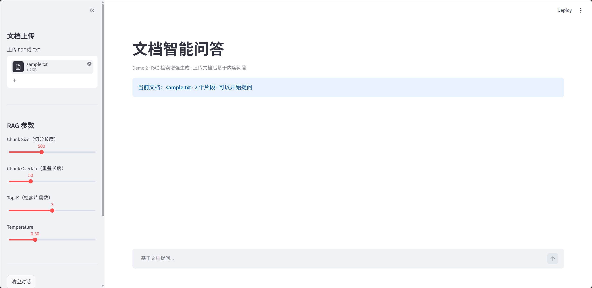
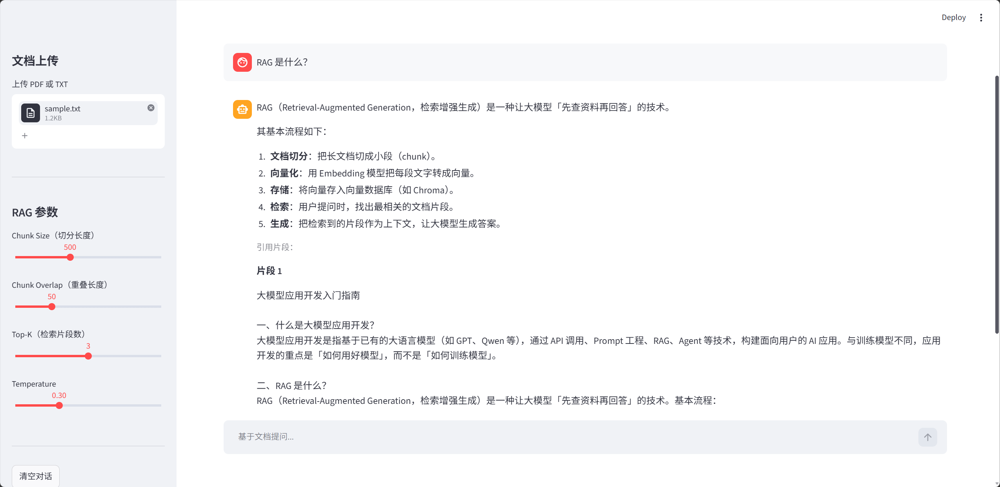

# LLM 应用开发实践

基于 **Streamlit + 阿里云百炼 API** 的大模型应用 Demo 集合，涵盖对话助手与文档智能问答（RAG）两个完整项目。

## 项目简介

本仓库是大模型应用开发的学习与实践成果，实现了从 API 调用、Prompt 工程到 RAG 检索增强生成的完整链路。每个 Demo 均可独立运行，附带 Web 界面，适合本地演示与面试展示。

---

## Demo 1：多角色 AI 对话助手

基于 Streamlit 的 Web 对话应用，支持角色切换、多轮对话与 Prompt 参数调节。

| 主界面 | 多轮对话 |
|--------|----------|
|  |  |

| 角色切换 | 参数调节 |
|----------|----------|
|  |  |

**核心功能**

- 3 种预设 system prompt（通用助手 / Python 教练 / 面试练习官）
- 基于 `session_state` 的多轮对话记忆
- Temperature 滑块实时调节输出风格

**运行**

```bash
streamlit run demos/demo1-ai-chat-assistant/app.py
```

---

## Demo 2：文档智能问答（RAG）

基于 LangChain + Chroma 的文档问答系统。上传 PDF/TXT 后，自动切分、向量化并存入向量库；用户提问时检索相关片段，再让大模型基于文档内容生成答案。

| 文档上传 | 智能问答 |
|----------|----------|
|  |  |

| 引用片段 |
|----------|
|  |

**核心功能**

- 支持 PDF / TXT 文档上传与解析
- 文档切分（Chunk）+ Embedding 向量化 + Chroma 存储
- 相似度检索 Top-K 片段，拼入 Prompt 生成答案
- 展示引用来源，便于验证回答依据

**RAG 流程**

```
上传文档 → 切分 Chunk → Embedding 向量化 → 存入 Chroma
                                              ↓
用户提问 → 相似度检索 Top-K 片段 → 拼进 Prompt → 大模型回答
```

**运行**

```bash
streamlit run demos/demo2-doc-rag/app.py
```

测试文档：`demos/demo2-doc-rag/sample_docs/sample.txt`

---

## 快速开始

```bash
git clone https://github.com/GuiXZhao/llm-agent-learning.git
cd llm-agent-learning
conda activate agent-dev
pip install -r requirements.txt
copy .env.example .env
```

在 `.env` 中配置百炼 API Key 后即可运行上述 Demo。

## 项目结构

```
llm-agent-learning/
├── demos/
│   ├── demo1-ai-chat-assistant/
│   │   └── app.py
│   └── demo2-doc-rag/
│       ├── app.py
│       ├── README.md
│       └── sample_docs/
├── docs/screenshots/
│   ├── 01-main/
│   ├── 02-multi-turn/
│   ├── 03-roles/
│   ├── 04-temperature/
│   ├── 05-doc-rag-upload/
│   ├── 06-doc-rag-qa/
│   └── 07-doc-rag-sources/
├── requirements.txt
└── .env.example
```

## 技术栈

Python · Streamlit · OpenAI SDK · LangChain · Chroma · Embedding · 阿里云百炼 · Prompt Engineering · RAG · Git
