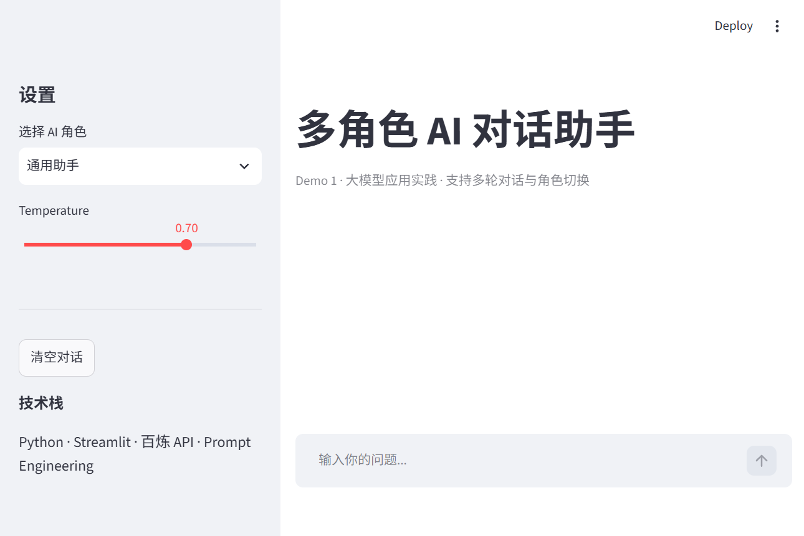
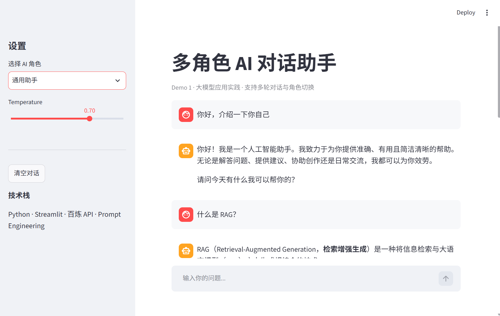
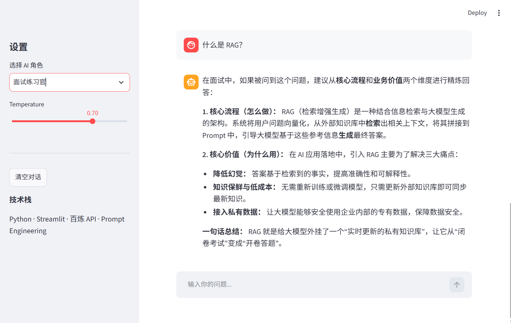
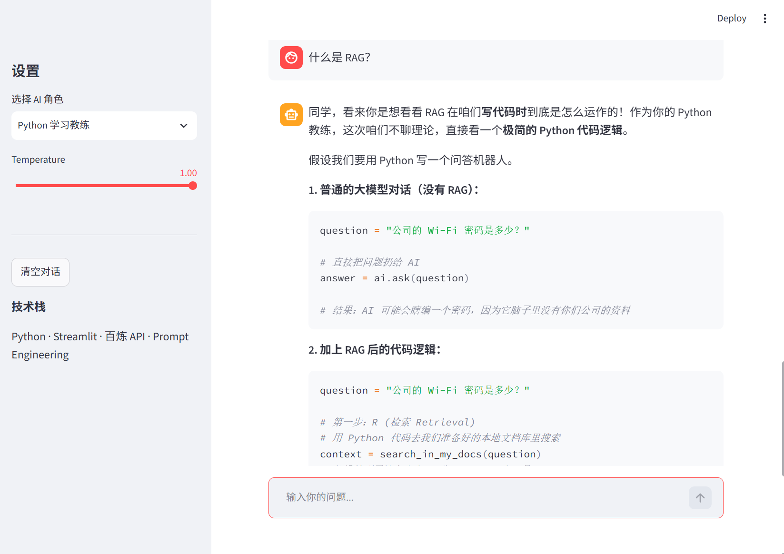

# 多角色 AI 对话助手

基于 **Streamlit + 阿里云百炼 API** 的 Web 对话应用，支持角色切换、多轮对话与 Prompt 参数调节。

## 项目简介

本项目是一个大模型应用开发实践 Demo，实现了从 API 调用到 Web 界面落地的完整链路。用户可在浏览器中选择不同 AI 角色进行多轮问答，适用于通用助手、Python 学习辅导、面试练习等场景。

## 功能演示

| 主界面 | 多轮对话 |
|--------|----------|
|  |  |

| 角色切换 | 参数调节 |
|----------|----------|
|  |  |

更多截图见 [`docs/screenshots/`](docs/screenshots/) 目录。

## 核心功能

- **多角色切换**：3 种预设 system prompt（通用助手 / Python 教练 / 面试练习官）
- **多轮对话**：基于 `session_state` 保存上下文，支持连续追问
- **参数可调**：Temperature 滑块实时调节输出风格
- **一键清空**：快速重置对话历史

## 技术实现

| 模块 | 方案 |
|------|------|
| 前端界面 | Streamlit 聊天组件 |
| 模型服务 | 阿里云百炼 OpenAI 兼容接口（qwen3.7-plus） |
| 对话管理 | messages 列表（system + user + assistant） |
| 配置管理 | python-dotenv + `.env` |
| 开发环境 | Python 3.12 · Anaconda |

## 快速开始

```bash
git clone https://github.com/GuiXZhao/llm-agent-learning.git
cd llm-agent-learning
conda activate agent-dev
pip install -r requirements.txt
copy .env.example .env
streamlit run demos/demo1-ai-chat-assistant/app.py
```

在 `.env` 中配置百炼 API Key 后即可运行。

## 项目结构

```
llm-agent-learning/
├── demos/demo1-ai-chat-assistant/
│   └── app.py
├── docs/screenshots/
│   ├── 01-main/
│   ├── 02-multi-turn/
│   ├── 03-roles/
│   └── 04-temperature/
├── requirements.txt
└── .env.example
```

## 技术栈

Python · Streamlit · OpenAI SDK · 阿里云百炼 · Prompt Engineering · Git
